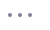
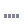
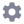

# st-custom-static
Rebuilding streamlit repo with custom animation. Drop-in replacements to static folders (just find right version &amp; copy on top of /site-packages/static/ folder)

By default this is built using animation #3 (three dots), replacing the classic 'running man' on the official distribution.

### Available Animations

| # | Name | Preview |
|---|------|---------|
| 1 | Spinning Sync |  |
| 2 | Pulsing Dot |  |
| 3 | Three Dots |  |
| 4 | Bar Chart |  |
| 5 | Rotating Gear |  |
| 6 | Hourglass |  |
| 7 | Progress Ring |  |

If you want to built it yourself, detailed instructions are described on the `optional-build-yourself` folder.
